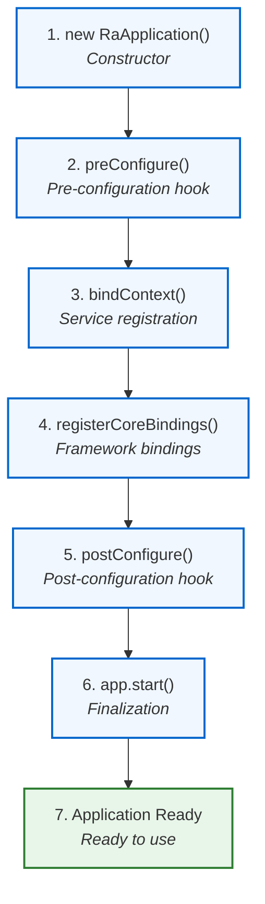

# Application Lifecycle

Understanding the application lifecycle helps you know when and how to initialize services, configure providers, and set up your @ra-core-infra application.

## Lifecycle Overview



## Lifecycle Phases in Detail

### Phase 1: Constructor

**When**: Application instance is created

**What happens**:
- Venizia DI container is initialized
- Base configuration is set up
- Parent class (`BaseRaApplication`) initializes

**Your code**:
```typescript
const app = new RaApplication();
```

**Framework code** (happens automatically):
```typescript
export abstract class BaseRaApplication extends Container {
  constructor() {
    super();  // Initialize Venizia container
    // Set up base configuration
  }
}
```

::: tip Constructor vs Lifecycle Hooks
Don't override the constructor unless necessary. Use lifecycle hooks (`preConfigure`, `bindContext`, `postConfigure`) instead.
:::

### Phase 2: preConfigure()

**When**: Before any bindings are registered

**Purpose**: Early setup that other bindings depend on

**Use for**:
- Loading configuration from files
- Environment variable validation
- Setting up loggers or debugging tools
- Initializing external connections

**Example**:
```typescript
export class RaApplication extends BaseRaApplication {
  override async preConfigure(): Promise<void> {
    // Load environment-specific configuration
    const config = await this.loadConfig();

    // Validate required environment variables
    this.validateEnv();

    // Set up debugging
    if (import.meta.env.DEV) {
      Logger.setDebug(true);
    }

    console.log('Application pre-configuration complete');
  }

  private async loadConfig() {
    // Load configuration from file or API
    return {
      apiUrl: import.meta.env.VITE_API_URL,
      timeout: parseInt(import.meta.env.VITE_API_TIMEOUT || '30000'),
    };
  }

  private validateEnv() {
    const required = ['VITE_API_URL'];
    for (const key of required) {
      if (!import.meta.env[key]) {
        throw new Error(`Missing required environment variable: ${key}`);
      }
    }
  }
}
```

### Phase 3: bindContext()

**When**: After `preConfigure()`, before framework bindings

**Purpose**: **Register all your services and providers**

**Use for**:
- Binding services to the DI container
- Configuring providers (data, auth, i18n)
- Registering custom implementations

**Example**:
```typescript
export class RaApplication extends BaseRaApplication {
  override bindContext(): void {
    // 1. Configure data provider
    this.bind<IRestDataProviderOptions>({
      key: CoreBindings.REST_DATA_PROVIDER_OPTIONS,
    }).toValue({
      url: import.meta.env.VITE_API_URL || 'http://localhost:3001/api',
      noAuthPaths: ['/auth/sign-in', '/auth/sign-up'],
    });

    // 2. Configure auth provider
    this.bind<IAuthProviderOptions>({
      key: CoreBindings.AUTH_PROVIDER_OPTIONS,
    }).toValue({
      paths: {
        signIn: '/auth/sign-in',
        checkAuth: '/auth/whoami',
      },
    });

    // 3. Configure i18n provider
    this.bind<II18nProviderOptions>({
      key: CoreBindings.I18N_PROVIDER_OPTIONS,
    }).toValue({
      i18nSources: {
        en: englishMessages,
        vi: vietnameseMessages,
      },
      listLanguages: [
        { locale: 'en', name: 'English' },
        { locale: 'vi', name: 'Tiếng Việt' },
      ],
    });

    // 4. Register services
    this.service(ProductApi);
    this.service(UserApi);
    this.service(OrderApi);

    // 5. Register custom providers (optional)
    this.bind({ key: 'providers.CustomAuth' })
      .toProvider(CustomAuthProvider);
  }
}
```

::: warning Most Important Phase
`bindContext()` is where 90% of your application configuration happens. This is where you define what services are available and how they're configured.
:::

### Phase 4: registerCoreBindings()

**When**: After `bindContext()`, automatically called by framework

**Purpose**: Register framework-provided services

**What happens** (automatically):
- `DefaultRestDataProvider` is registered
- `DefaultAuthProvider` is registered
- `DefaultI18nProvider` is registered
- `DefaultNetworkRequestService` is registered

**Your code**: Nothing! This happens automatically.

**Framework code** (happens in `BaseRaApplication`):
```typescript
protected registerCoreBindings(): void {
  // Register default providers
  this.bind({ key: CoreBindings.DEFAULT_REST_DATA_PROVIDER })
    .toProvider(DefaultRestDataProvider);

  this.bind({ key: CoreBindings.DEFAULT_AUTH_PROVIDER })
    .toProvider(DefaultAuthProvider);

  this.bind({ key: CoreBindings.DEFAULT_I18N_PROVIDER })
    .toProvider(DefaultI18nProvider);

  // ... more framework bindings
}
```

### Phase 5: postConfigure()

**When**: After all bindings are registered

**Purpose**: Post-setup logic that requires services to be available

**Use for**:
- Initializing services that depend on other services
- Setting up event listeners
- Running migrations or data seeding
- Connecting to external services

**Example**:
```typescript
export class RaApplication extends BaseRaApplication {
  override async postConfigure(): Promise<void> {
    // Get services from container
    const authService = this.get<DefaultAuthService>({
      key: 'services.DefaultAuthService',
    });

    // Initialize services
    await this.initializeServices();

    // Set up global error handler
    this.setupErrorHandling();

    console.log('Application post-configuration complete');
  }

  private async initializeServices() {
    // Services are now available for initialization
    const logger = this.get<Logger>({ key: 'services.Logger' });
    logger.info('Initializing services...');
  }

  private setupErrorHandling() {
    window.addEventListener('unhandledrejection', (event) => {
      console.error('Unhandled promise rejection:', event.reason);
    });
  }
}
```

### Phase 6: app.start()

**When**: Explicitly called by you

**Purpose**: Finalize configuration and make the app ready to use

**What happens**:
1. Calls `preConfigure()` if not already called
2. Calls `bindContext()` if not already called
3. Calls `registerCoreBindings()`
4. Calls `postConfigure()` if not already called
5. Finalizes the DI container
6. Returns a promise that resolves when complete

**Your code**:
```typescript
const app = new RaApplication();
await app.start();  // Wait for all lifecycle phases to complete
```

### Phase 7: Application Ready

**When**: After `app.start()` completes

**What you can do**:
- Get services from the container
- Use the container in React components
- Access all registered services and providers

**Example**:
```typescript
// In your main.tsx
import 'reflect-metadata';
import React from 'react';
import ReactDOM from 'react-dom/client';
import { RaApplication } from './application/application';
import App from './App';

// Create and start application
const applicationContext = new RaApplication();
await applicationContext.start();

// Render React app with container
ReactDOM.createRoot(document.getElementById('root')!).render(
  <React.StrictMode>
    <CoreApplicationContext value={{ container: applicationContext, registry: applicationContext, logger: null }}>
      <App />
    </CoreApplicationContext>
  </React.StrictMode>
);
```

## Lifecycle Hooks Summary

| Hook | When | Purpose | Return Type | Required |
|------|------|---------|-------------|----------|
| `preConfigure()` | Before bindings | Early setup | `void \| Promise<void>` | No |
| `bindContext()` | After preConfigure | Register services | `void \| Promise<void>` | **Yes** |
| `postConfigure()` | After bindings | Late initialization | `void \| Promise<void>` | No |

## Async Lifecycle

All lifecycle hooks support **async/await**:

```typescript
export class RaApplication extends BaseRaApplication {
  override async preConfigure(): Promise<void> {
    // Async operations are supported
    const config = await fetch('/api/config').then(r => r.json());
    this.config = config;
  }

  override async bindContext(): Promise<void> {
    // Even bindContext can be async
    const dynamicConfig = await this.loadDynamicConfig();

    this.bind({ key: 'config.dynamic' }).toValue(dynamicConfig);
    this.service(ProductApi);
  }

  override async postConfigure(): Promise<void> {
    // Post-configuration can be async too
    await this.runMigrations();
  }
}

// Start will wait for all async operations
await app.start();  // Waits for preConfigure, bindContext, postConfigure
```

## Common Patterns

### Pattern 1: Environment-Specific Configuration

```typescript
export class RaApplication extends BaseRaApplication {
  override bindContext(): void {
    const isDev = import.meta.env.DEV;

    // Development configuration
    if (isDev) {
      this.bind({ key: CoreBindings.REST_DATA_PROVIDER_OPTIONS })
        .toValue({
          url: 'http://localhost:3001/api',
          timeout: 60000,  // Longer timeout for debugging
        });
    }
    // Production configuration
    else {
      this.bind({ key: CoreBindings.REST_DATA_PROVIDER_OPTIONS })
        .toValue({
          url: 'https://api.production.com',
          timeout: 30000,
        });
    }
  }
}
```

### Pattern 2: Conditional Service Registration

```typescript
export class RaApplication extends BaseRaApplication {
  override bindContext(): void {
    // Always register core services
    this.service(ProductApi);
    this.service(UserApi);

    // Conditionally register additional services
    if (import.meta.env.VITE_ENABLE_ANALYTICS === 'true') {
      this.service(AnalyticsService);
    }

    if (import.meta.env.VITE_ENABLE_NOTIFICATIONS === 'true') {
      this.service(NotificationService);
    }
  }
}
```

### Pattern 3: Service Initialization

```typescript
export class RaApplication extends BaseRaApplication {
  override async postConfigure(): Promise<void> {
    // Get service from container
    const authService = this.get<DefaultAuthService>({
      key: 'services.DefaultAuthService',
    });

    // Initialize service with startup data
    const token = localStorage.getItem('@app/auth/token');
    if (token) {
      await authService.validateToken(token);
    }
  }
}
```

## Debugging Lifecycle

Add logging to understand the lifecycle flow:

```typescript
export class RaApplication extends BaseRaApplication {
  override async preConfigure(): Promise<void> {
    console.log('1. preConfigure: Starting...');
    // Your code here
    console.log('1. preConfigure: Complete');
  }

  override async bindContext(): Promise<void> {
    console.log('2. bindContext: Starting...');
    // Your code here
    console.log('2. bindContext: Complete');
  }

  override async postConfigure(): Promise<void> {
    console.log('3. postConfigure: Starting...');
    // Your code here
    console.log('3. postConfigure: Complete');
  }
}

// In console you'll see:
// 1. preConfigure: Starting...
// 1. preConfigure: Complete
// 2. bindContext: Starting...
// 2. bindContext: Complete
// 3. postConfigure: Starting...
// 3. postConfigure: Complete
```

## Best Practices

### ✅ Do

- Use `bindContext()` for service registration
- Use `preConfigure()` for environment validation
- Use `postConfigure()` for service initialization
- Make lifecycle hooks async when needed
- Log lifecycle phases in development

### ❌ Don't

- Don't access services in `preConfigure()` (they're not registered yet)
- Don't override the constructor (use lifecycle hooks)
- Don't forget to call `await app.start()`
- Don't register services in `postConfigure()` (too late)

## Troubleshooting

### "Service not found" Error

**Cause**: Trying to access service before `bindContext()` runs.

**Solution**: Ensure you're accessing services after `app.start()` completes.

### Async Initialization Hangs

**Cause**: Lifecycle hook never resolves.

**Solution**: Check for unhandled promises or infinite loops in async hooks.

### Circular Dependency

**Cause**: Service A depends on Service B, which depends on Service A.

**Solution**: Refactor to remove circular dependency or use lazy injection.

## Summary

The application lifecycle provides **structured initialization** in this order:

1. **`preConfigure()`** - Validate environment, load config
2. **`bindContext()`** - Register services and providers ⭐
3. **Framework bindings** - Automatic framework setup
4. **`postConfigure()`** - Initialize services
5. **`app.start()`** - Finalize and make ready

## Next Steps

- **[Project Structure](./project-structure)** - See recommended organization
- **[Dependency Injection Guide](/guides/dependency-injection/)** - Deep dive into DI
---

**Ready for project structure?** Continue to [project structure →](./project-structure)
