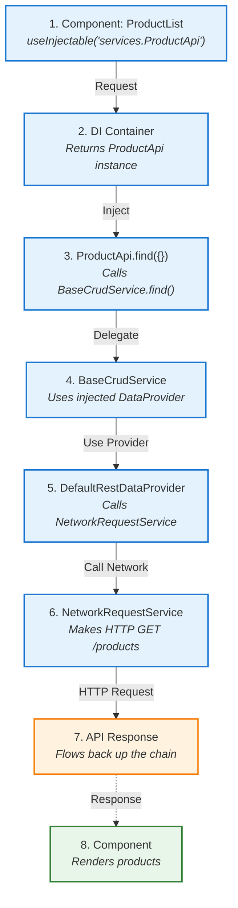

# Your First Application

Let's build a minimal working @ra-core-infra application from scratch. By the end of this guide, you'll have a running app with dependency injection and a simple service.

**Time to complete**: ~15 minutes

## What You'll Build

A simple product listing application that:

- Uses dependency injection with Venizia
- Fetches data from a REST API
- Displays products in a React component
- Uses type-safe service injection

## Prerequisites

Before starting, ensure you've completed:

- [Installation](./installation) - Dependencies installed
- [Project Setup](./project-setup) - Project structure created

## Step 1: Import reflect-metadata

This is **critical**. Open `src/main.tsx` and add `reflect-metadata` as the **first import**:

```typescript
import 'reflect-metadata'; // Must be first!
import React from 'react';
import ReactDOM from 'react-dom/client';
import App from './App.tsx';
import './index.css';

ReactDOM.createRoot(document.getElementById('root')!).render(
  <React.StrictMode>
    <App />
  </React.StrictMode>
);
```

::: danger Critical
If you forget this import or place it after other imports, decorators will fail with runtime errors.
:::

## Step 2: Create the Application Class

Create `src/application/application.ts`:

```typescript
import { BaseRaApplication, CoreBindings, DefaultRestDataProvider } from '@minimaltech/ra-core-infra';
import type { IRestDataProviderOptions } from '@minimaltech/ra-core-infra';
import { ProductApi } from './services/apis/product.api';
import { BindingScopes } from '@venizia/ignis-inversion';

export class RaApplication extends BaseRaApplication {
    /**
     * Configure dependency injection bindings
     */
    bindContext(): void {
        // Bind REST data provider options
        this.bind<IRestDataProviderOptions>({
            key: CoreBindings.REST_DATA_PROVIDER_OPTIONS,
        }).toValue({
            url: import.meta.env.VITE_API_URL || 'https://fakestoreapi.com',
            noAuthPaths: ['/products', '/users'],
        });

        // Bind the default REST data provider
        this.bind({
            key: CoreBindings.DEFAULT_REST_DATA_PROVIDER,
        }).toClass(DefaultRestDataProvider)
            .setScope(BindingScopes.SINGLETON);
    }
}
```

**What's happening here?**

1. Extend `BaseRaApplication` to create your app
2. Override `bindContext()` to configure services
3. Bind configuration for the REST data provider
4. Use environment variables for the API URL

## Step 3: Create a Product Entity

Create the product entity structure:

```bash
mkdir -p src/entities/product/{model,api}
```

Create three files for the entity:

**1. Types** (`src/entities/product/model/product.types.ts`):
```typescript
export interface IProduct {
  id: number;
  title: string;
  price: number;
  description: string;
  category: string;
  image: string;
}
```

**2. API Service** (`src/entities/product/api/productApi.ts`):
```typescript
import { BaseCrudService, CoreBindings } from '@minimaltech/ra-core-infra';
import type { IDataProvider } from '@minimaltech/ra-core-infra';
import { inject } from '@venizia/ignis-inversion';
import type { IProduct } from '../model/product.types';

export class ProductApi extends BaseCrudService<IProduct> {
  constructor(
    @inject({ key: CoreBindings.DEFAULT_REST_DATA_PROVIDER })
    protected dataProvider: IDataProvider
  ) {
    super({
      scope: 'ProductApi',
      dataProvider,
      serviceOptions: { basePath: '/products' },
    });
  }
}
```

**3. Public API** (`src/entities/product/index.ts`):
```typescript
export type { IProduct } from './model/product.types';
export { ProductApi } from './api/productApi';
```

::: tip
`BaseCrudService` provides CRUD methods (find, findById, create, update, delete) automatically. The `@inject` decorator gets the data provider from the DI container.
:::

## Step 4: Register the Service

Update `src/application/application.ts` to register the service:

```typescript
import { BaseRaApplication, CoreBindings, DefaultRestDataProvider } from '@minimaltech/ra-core-infra';
import type { IRestDataProviderOptions } from '@minimaltech/ra-core-infra';
import { ProductApi } from '@/entities/product';
import { BindingScopes } from '@venizia/ignis-inversion';

export class RaApplication extends BaseRaApplication {
    /**
     * Configure dependency injection bindings
     */
    bindContext(): void {
        // Bind REST data provider options
        this.bind<IRestDataProviderOptions>({
            key: CoreBindings.REST_DATA_PROVIDER_OPTIONS,
        }).toValue({
            url: import.meta.env.VITE_API_URL || 'https://fakestoreapi.com',
            noAuthPaths: ['/products', '/users'],
        });

        // Bind the default REST data provider
        this.bind({
            key: CoreBindings.DEFAULT_REST_DATA_PROVIDER,
        }).toClass(DefaultRestDataProvider)
            .setScope(BindingScopes.SINGLETON);

        // Bind application services
        this.bind({ key: 'services.ProductApi' })
            .toClass(ProductApi)
            .setScope(BindingScopes.SINGLETON);
    }
}
```

## Step 5: Create Application Context Provider

Create `src/application/ApplicationContext.tsx`:

```typescript
import { ApplicationContext as CoreApplicationContext } from '@minimaltech/ra-core-infra';
import { RaApplication } from './application';
import type { ReactNode } from 'react';

let applicationContext = new RaApplication();
await applicationContext.start();


interface Props {
    children: ReactNode;
}

/**
 * Application Context Provider
 * Provides DI container to all child components
 */
export function ApplicationContext({ children }: Props) {
    return (
        <CoreApplicationContext value={{ container: applicationContext, registry: applicationContext, logger: null }}>
    {children}
    </CoreApplicationContext>
);
}
```

## Step 6: Create a Product List Page

Create the page structure:

```bash
mkdir -p src/pages/product-list/ui
```

**Page Component** (`src/pages/product-list/ui/ProductListPage.tsx`):
```typescript
import { useInjectable } from '@minimaltech/ra-core-infra';
import { useQuery } from '@tanstack/react-query';
import { ProductApi } from '@/entities/product';
import type { IProduct } from '@/entities/product';

export function ProductListPage() {
    const productApi = useInjectable<ProductApi>({
        key: 'services.ProductApi',
    });

    const { data: products, isLoading, error } = useQuery<IProduct[]>({
        queryKey: ['products'],
        queryFn: () => productApi.find({}),
    });

    if (isLoading) return <div>Loading products...</div>;
    if (error) return <div>Error loading products: {error.message}</div>;

    return (
        <div>
            <h1>Product List</h1>
    <div style={{ display: 'grid', gridTemplateColumns: 'repeat(auto-fill, minmax(250px, 1fr))', gap: '1rem' }}>
    {products?.map((product) => (
        <div key={product.id} style={{ border: '1px solid #ccc', padding: '1rem', borderRadius: '8px' }}>
        
    <h3>{product.title}</h3>
    <p style={{ color: '#666' }}>${product.price}</p>
    <p style={{ fontSize: '0.9rem', color: '#999' }}>{product.category}</p>
    </div>
    ))}
    </div>
    </div>
);
}
```

**Public API** (`src/pages/product-list/index.ts`):
```typescript
export { ProductListPage } from './ui/ProductListPage';
```

## Step 7: Set Up TanStack Query

Update `src/App.tsx`:

```typescript
import { QueryClient, QueryClientProvider } from '@tanstack/react-query';
import React from 'react';
import { ApplicationContext } from './app/ApplicationContext';
import { ProductListPage } from '@/pages/product-list';

// Create a query client
const queryClient = new QueryClient({
  defaultOptions: {
    queries: {
      refetchOnWindowFocus: false,
      retry: 1,
    },
  },
});

function App() {
  return (
    <ApplicationContext>
      <QueryClientProvider client={queryClient}>
        <div style={{ padding: '2rem' }}>
          <ProductListPage />
        </div>
      </QueryClientProvider>
    </ApplicationContext>
  );
}

export default App;
```

## Step 8: Type Augmentation

For TypeScript autocomplete, create `src/types/ra-core-infra.d.ts`:

```typescript
import 'reflect-metadata';

declare module '@minimaltech/ra-core-infra' {
  interface IUseInjectableKeysOverrides {
    'services.ProductApi': true;
  }
}
```

This enables autocomplete for service keys in `useInjectable`.

## Step 9: Run Your Application

Start the development server:

```bash
bun run dev
# or
npm run dev
```

Open [http://localhost:3000](http://localhost:3000) in your browser.

You should see a grid of products loaded from the Fake Store API!

## Understanding the Data Flow

Let's trace how data flows through your application:



## What You've Learned

Congratulations! You've built your first @ra-core-infra application. You now understand:

- **Dependency Injection** - Creating an app, binding services, injecting dependencies
- **Service Layer** - Creating and using CRUD services
- **Data Providers** - Configuring REST API communication
- **React Integration** - Using `useInjectable` hook in components
- **Type Safety** - TypeScript interfaces and type augmentation

## Troubleshooting

### "Cannot read properties of undefined (reading 'find')"

**Cause**: ProductApi not properly registered or injected.

**Solution**: Ensure:
1. Service is registered in `application.ts` with `bindContext()`
2. Key matches exactly: `'services.ProductApi'`
3. `ApplicationContext` wraps your app

### "Decorators are not valid here"

**Cause**: TypeScript decorators not enabled.

**Solution**: Check `tsconfig.json` has:
```json
{
  "experimentalDecorators": true,
  "emitDecoratorMetadata": true
}
```

### "reflect-metadata must be imported before..."

**Cause**: `reflect-metadata` not imported first.

**Solution**: Add `import 'reflect-metadata';` as the **first line** in `src/main.tsx`.

### "This syntax is not allowed when 'erasableSyntaxOnly' is enabled"
**Solution**: Ensure that `tsconfig.json` has `"erasableSyntaxOnly": false` or remove the option entirely.

### "Property 'env' does not exist on type 'ImportMeta'."
**Solution**: Ensure that `tsconfig.json` has `"include": ["env.d.ts"]`

`env.d.ts` should contain:
```typescript
/// <reference types="vite/client" />
```
For more issues, see [Troubleshooting](/troubleshooting/).

## Next Steps

Now that you have a working application:

- **[Configuration Guide](./configuration)** - Set up constants and advanced config
- **[Core Concepts](/core-concepts/)** - Understand architecture deeply
- **[Dependency Injection Guide](/guides/dependency-injection/)** - Master DI patterns
- **[Data Providers Guide](/guides/data-providers/)** - Advanced data handling
- **[Todo App Tutorial](/tutorials/todo-app)** - Build a complete CRUD app

---

**Ready for more?** Learn about [configuration →](./configuration)
